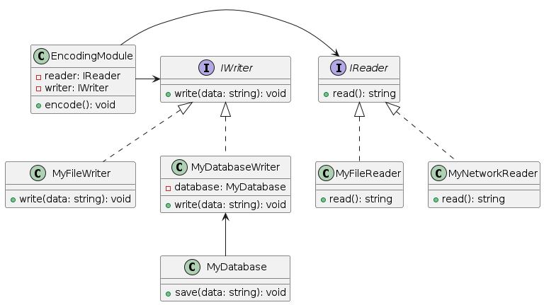

# Refactoring Summary
Before refactoring, the code violated the Dependency Inversion Principle (DIP) because it depended on concrete implementations .

After refactoring, the code adhered to the DIP by introducing abstractions for the IReader and IWriter interfaces. This made the EncodingModule class independent of specific implementations, allowing it to be flexible and easier to maintain. The MyDatabaseWriter class was also modified to use the MyDatabase class as a dependency that was injected into its constructor, rather than creating an instance of it within the write() method.

The new design is more modular and easier to maintain because it separates concerns and creates more abstraction. The EncodingModule class now only depends on abstractions, which can be implemented and changed without affecting the module itself. The MyDatabaseWriter class depends on the abstraction of the IWriter interface, but does not depend on any specific implementation, making it more flexible and testable.

Overall, the refactoring of the code improved its design by reducing dependencies and increasing abstraction, resulting in more maintainable and modular code.

