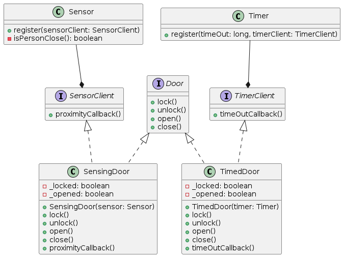

# Interface Segregation Principle Exercise Refactored
This is a refactored version of a code exercise implementing the Interface Segregation Principle.

## Problem Statement
The original code exercise provided a Door interface with four methods: lock(), unlock(), open(), and close(). The exercise required the creation of two types of doors: a TimedDoor that automatically locks itself after a set period of time, and a SensingDoor that opens itself when someone approaches it.

The initial implementation had both types of doors implementing the Door interface, which resulted in a violation of the Interface Segregation Principle. Specifically, the TimedDoor had to implement the open() and close() methods even though it did not use them, and the SensingDoor had to implement the lock() and unlock() methods even though it did not need them.

## Refactored Solution
To solve the problem, we refactored the code to comply with the Interface Segregation Principle. We created two new interfaces, SensorClient and TimerClient, which define the methods needed for the SensingDoor and TimedDoor, respectively. We then had each of these types of doors implement their corresponding interface.

We also created two new classes, Sensor and Timer, which implement the logic for the SensingDoor and TimedDoor, respectively. These classes take in a SensorClient or TimerClient as a parameter and register them to be notified when the sensor detects someone or when the timer reaches the set time, respectively.

Finally, we updated the SensingDoor and TimedDoor classes to use the new interfaces and to delegate the logic to the Sensor and Timer classes.

## Conclusion
By refactoring the code to comply with the Interface Segregation Principle, we were able to improve the maintainability and flexibility of the code. The separation of concerns between the Door, Sensor, Timer, SensorClient, and TimerClient classes allowed each component to focus on its specific functionality and reduced the coupling between them.

## Diagram

