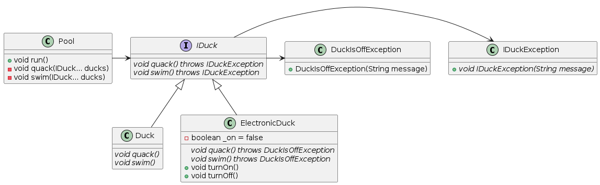

# Liskov Substitution Principle (LSP) Exercise Refactored
Introduction
This project is a refactored version of a codebase that violates the Liskov Substitution Principle (LSP) and aims to provide an updated implementation that adheres to the principle.

## Problem Statement
The original codebase had two classes, Duck and ElectronicDuck, that were both able to quack and swim. However, the ElectronicDuck class had additional functionality for turning the duck on and off, which would affect its ability to quack and swim. This resulted in a violation of the LSP since the ElectronicDuck class could not be substituted for the Duck class without causing unexpected behavior.

## Solution
To fix the violation of the LSP, the codebase was refactored to implement an interface called IDuck that both the Duck and ElectronicDuck classes would implement. The IDuck interface defines two methods, quack and swim, that both classes must implement. Additionally, the ElectronicDuck class now throws a DuckIsOffException if the duck is turned off and either quack or swim is called, which provides a clear indication of why the method call failed.

The refactored codebase now allows for both the Duck and ElectronicDuck classes to be used interchangeably, without any unexpected behavior. Additionally, the use of an interface provides a clear contract for the methods that must be implemented by each class, making the codebase more maintainable and scalable in the long run.

## Conclusion
By refactoring the original codebase to adhere to the Liskov Substitution Principle, the resulting implementation is now more robust, maintainable, and scalable. This project serves as a good example of how to identify and fix violations of the LSP in a codebase, and highlights the importance of designing software systems that adhere to the SOLID principles.

## Diagram

